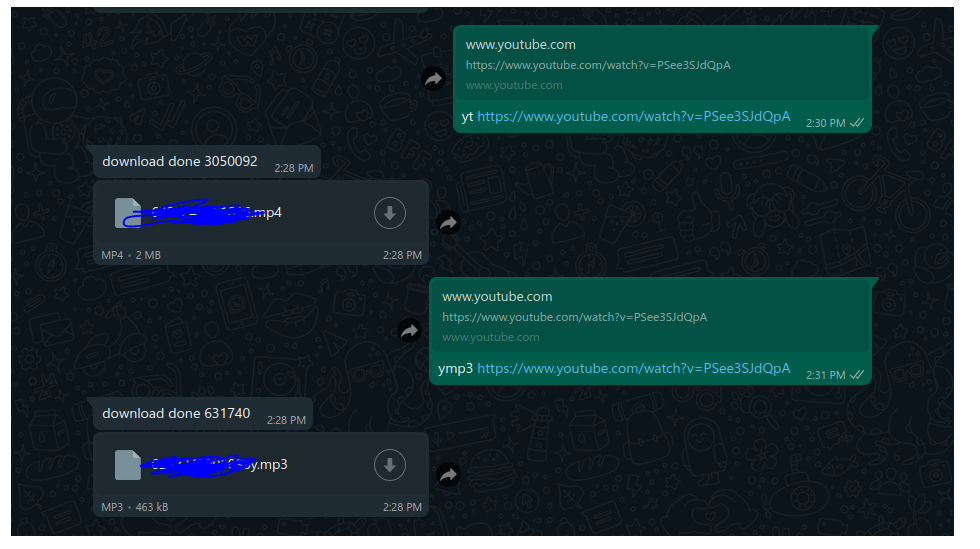

how to use 

first npm install (to add all package needed)

install yt-dlp to works 

sudo curl -L https://github.com/yt-dlp/yt-dlp/releases/latest/download/yt-dlp -o /home/xxx/yt-dlp

sudo chmod a+rx /home/xxx/yt-dlp

^ i dont know how to run this on windows or git-bash

or here some information : https://github.com/yt-dlp/yt-dlp

after nothing error run

node war.js

thanks for : https://github.com/pedroslopez/whatsapp-web.js/releases/tag/v1.17.0
P.S : im using arch on this project
