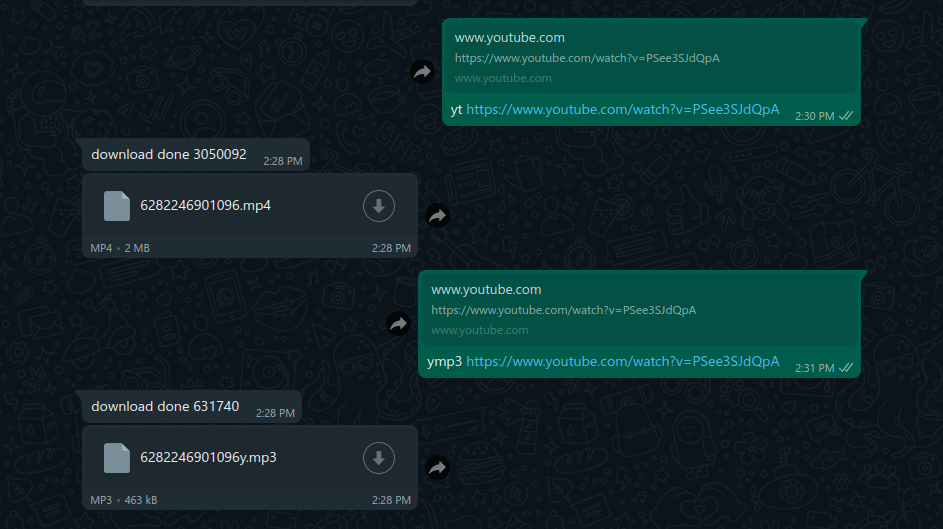

how to use 

first npm install (to add all package needed)

install yt-dlp to works 

sudo curl -L https://github.com/yt-dlp/yt-dlp/releases/latest/download/yt-dlp -o /usr/local/bin/yt-dlp
sudo chmod a+rx /usr/local/bin/yt-dlp
sudo wget https://github.com/yt-dlp/yt-dlp/releases/latest/download/yt-dlp -O /usr/local/bin/yt-dlp
sudo chmod a+rx /usr/local/bin/yt-dlp
sudo aria2c https://github.com/yt-dlp/yt-dlp/releases/latest/download/yt-dlp --dir /usr/local/bin -o yt-dlp
sudo chmod a+rx /usr/local/bin/yt-dlp

or here some information : https://github.com/yt-dlp/yt-dlp

after nothing error run

node war.js

thanks for : https://github.com/pedroslopez/whatsapp-web.js/releases/tag/v1.17.0
